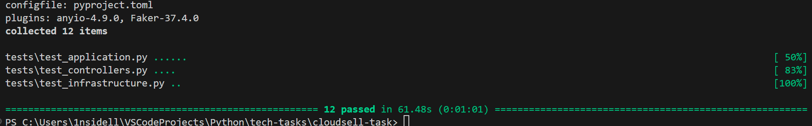
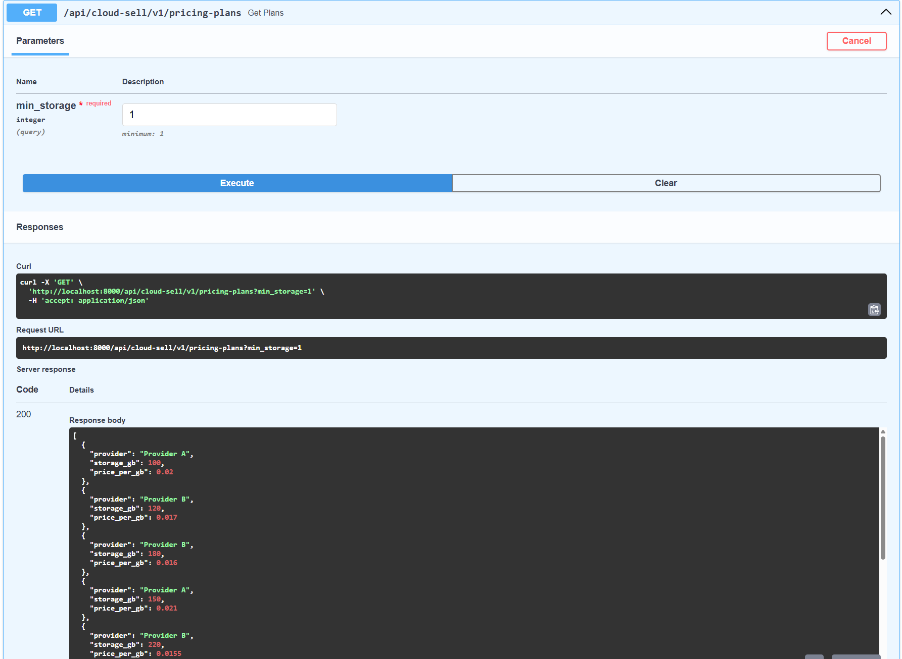
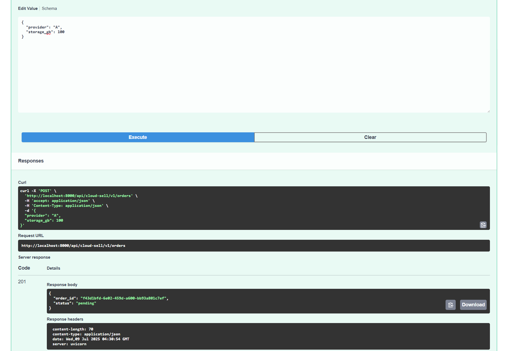
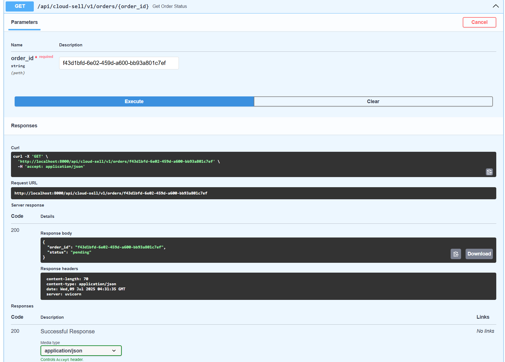
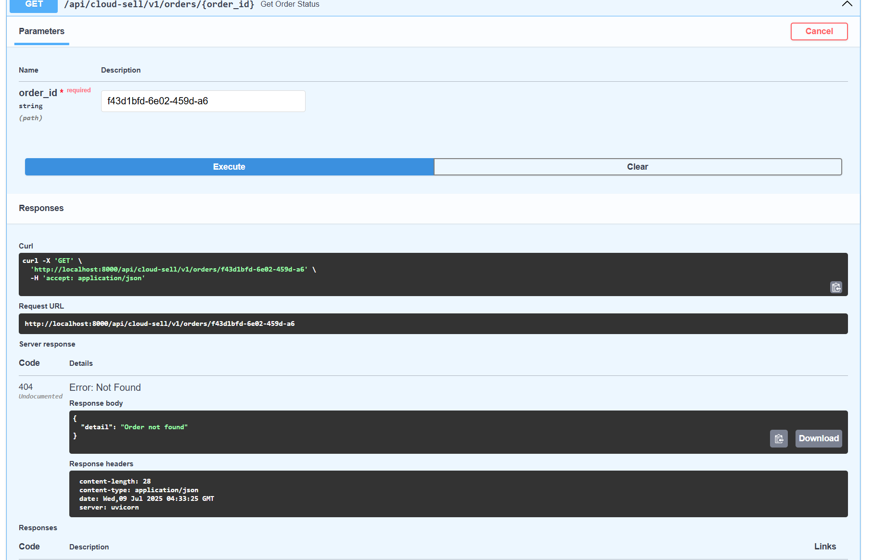

## Мои комментарии к решению и архитектуре вы можете увидеть в самом конце после изображений.

### 1. Clone and Install

ВНИМАНИЕ: для установки зависимостей вам нужен uv.

```bash
git clone https://github.com/1nsidell/cloudsell-task.git
cd cloudsell-task
uv sync
```


### 2. Start the Service

```bash
uvicorn app.main.main:make_app --factory --host 0.0.0.0 --port 8000
```

После запуска сервера API доступен:

Swagger UI: http://localhost:8000/docs


### 3. Tests the Service

```bash
pytest
ruff check .
mypy .
```


### 4. Examples of query work.

##### Тесты:


#### Провайдеры:


#### Провайдеры не найдены:


#### Создание заказа:


#### Статус заказа до:


#### Статус заказа после 1-ой минуты:


#### Заказ не найден:



### 5. Комментарии.

1. Не очень было понятно, что вы хотели бы увидеть от реализации редис, я не понял формулировку.
Поэтому просто поднял редис и прикрутил к главному сервису readiness healthcheck,
который просто делает пинг запрос в редис, а так же написал helthcheck проверку
для основного сервиса на основе этого эндпоинта. Но для этого редис контейнер и сервис 
должны быть в одной сети, если хотите проверить работоспособность, то 

```bash
docker network create cloud-sell-network
```

2. Что касается стека, который был указан. Использовал Depends с намерением не нарушить 
dependency rule и я бы лично использовал другие технологии для реализации DI, т.к. Depends очень ограничивает. Считваю, что даже прокидывать зависимости вручную удобнее.

3. Что касается архитектуры, то сущности лежат в Domain и они фактически анемичные. 
Логика реализована в прикладном слое application, там же можно увидеть и интерфейсы (application/common/ports). Рядом с интерфейсами лежат DTO, чтобы не зависеть, от внешних библиотек в виде Пидантика, их мы принимаем на вход в интеракторы. Ну, и сами интеракторы.
В инфраструктуре лежат уже адаптеры к интерфейсам (самописный гейтвей, а так же провайдеры к внешним API).А так же конфиг и константы к приложению (infrastructure/common/config).
В презентации лежат контроллеры и пидантик модели для валидации запроса/ответа.
Ну, и main служит точкой сборки приложения. ioc это грубо говоря ioc-контейнер для создания всех нужных зависимостей силами Depends. 
Да, можно было написать проще, но я считаю, что от более сложной в сторону более лёгкой отойти намного легче, чем наоборот.